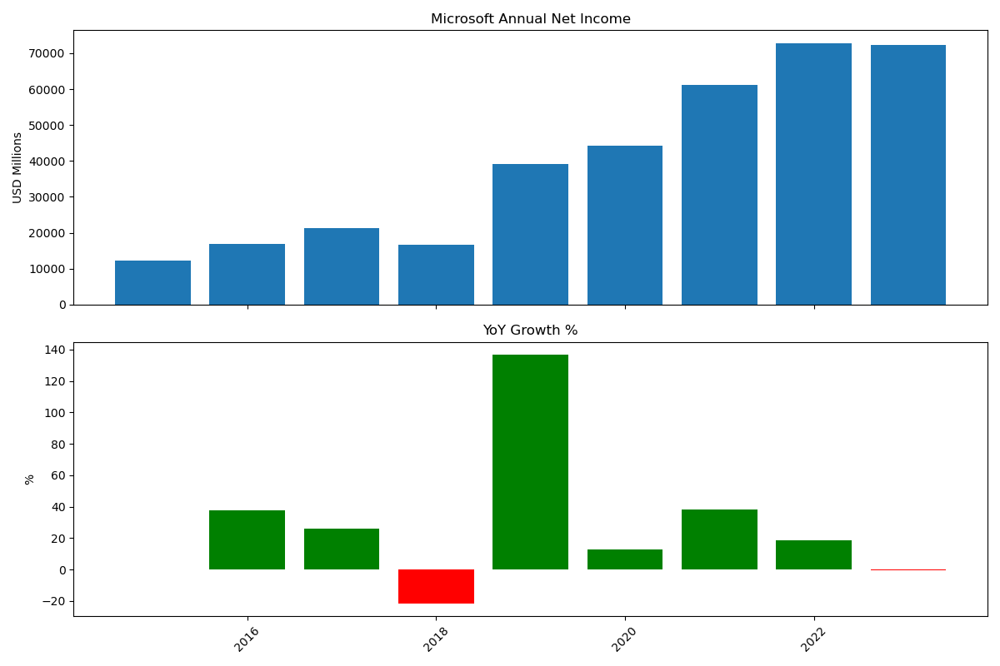

# 📊 Microsoft Financial Analysis Dashboard

## 📌 Description
This project analyzes Microsoft’s annual net income and visualizes financial performance using Python.  
All data is directly embedded in the code — no external dataset required.

It includes:  
- Net Income visualization  
- Year-over-Year (YoY) growth analysis  
- Profit vs Loss highlighting  

---

## 🚀 Features
- Data analysis using Pandas  
- Visualization using Matplotlib  
- Automatic YoY Growth calculation  
- Color-coded charts (green for profit growth, red for decline)  

---

## 🛠 Technologies Used
- Python  
- Pandas  
- Matplotlib  

---

## 📊 Output
The project generates:  
- Net Income bar chart  
- YoY Growth % chart  
- Saved image file (`output.png`)



---

## ▶️ How to Run
1. Install dependencies:
```bash
pip install -r requirements.txt
